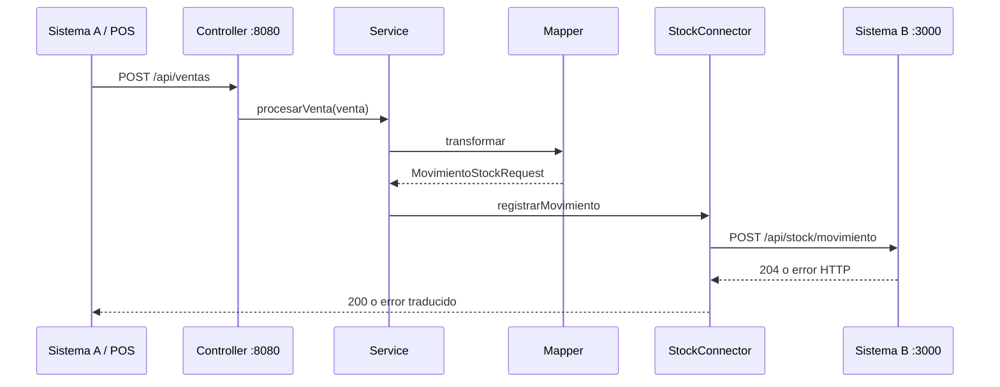

# Arquitectura

El proyecto ejecuta dos aplicaciones independientes:

- **Integración**, puerto `8080`: recibe ventas del POS y las transforma.
- **Sistema B ficticio**, puerto `3000`: simula el ERP, valida movimientos y actualiza inventario.

## Flujo

El endpoint manual `POST /api/movimientos` usa el mismo conector, pero genera fecha y referencia automáticamente. Está pensado para pruebas manuales; el POS debe seguir enviando el contrato completo a `/api/ventas`.

## Responsabilidades

| Componente | Función |
| --- | --- |
| Controllers | Recibir y validar HTTP; delegar la lógica. |
| Services | Coordinar transformación o generar datos del movimiento manual. |
| `MovimientoStockMapper` | Convertir `codigo` a `codigoProducto`, generar `SALIDA` y referencia de venta. |
| `StockConnector` | Desacoplar la integración de la implementación externa. |
| `SistemaBStockConnector` | Enviar el movimiento mediante HTTP. |
| `MockStockConnector` | Simular el envío en el perfil predeterminado. |
| `StockInventoryService` | Aplicar entradas y salidas transaccionales. |

El mapper conserva fecha, código y cantidad; omite precio y cajero porque B no los necesita. Las ventas usan referencia `VENTA-{ventaId}`.

## Conectores y datos

Sin perfil activo se usa `MockStockConnector`. Para comunicar con B, iniciar con perfil `sistema-b`; URL base y API key se configuran en `application.properties`.

El catálogo no tiene productos precargados. Se registra cada código explícitamente y las compras ingresan como `ENTRADA`; las ventas salen como `SALIDA`. H2 guarda catálogo y saldo en `fake-sistema-b/sistema-b.mv.db`, por lo que sobreviven al reinicio. El historial de movimientos es temporal. El simulador no reemplaza un ERP real.